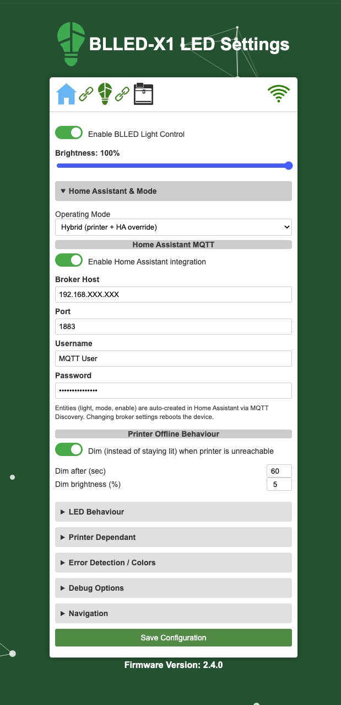
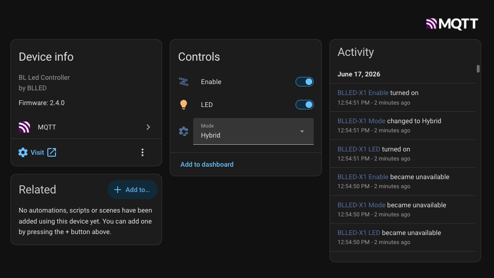

## Home Assistant BL Led Controller

The BL Led Controller is an ESP32 based device that connects to your Bambulab X1,X1C,P1P Or P1S and controls the LED strip based on the state of the printer.

> **This fork** ([plugowski/HomeAssistant_BLLEDController](https://github.com/plugowski/HomeAssistant_BLLEDController)) builds on DutchDeveloper's original firmware and adds full **Home Assistant** integration plus independent control of the LED strip. See the [Home Assistant guide](docs/home-assistant.md) for full details.

### What this fork adds

- **Home Assistant via MQTT Discovery** – the device opens a second MQTT connection to your Home Assistant broker (Mosquitto) and auto-creates entities with no YAML: a **light** (RGB **and** warm/cold-white colour temperature + brightness, with smooth transitions), a **mode select**, and a master **enable switch**.
- **Three operating modes** – *Printer only* (original behaviour), *Home Assistant only* (HA fully controls the strip), and *Hybrid* (the printer drives the strip but Home Assistant can override colour/temperature or force it off; the override is released when a print starts or the printer's chamber light is toggled).
- **Live state mirroring** – the HA light always reflects what is physically lit, whether set by the printer (printing, errors, etc.) or by Home Assistant, so you can always see and override the current state.
- **Master "Enable BLLED Light Control"** – a top-level switch (web UI **and** HA) that forces the strip fully off in any mode, e.g. via an automation when the printer is powered down. It applies instantly and stays in sync both ways.
- **Smarter offline behaviour** – instead of getting stuck on the last colour when the printer is unreachable, the strip dims after a configurable timeout and keeps retrying the connection in the background.
- **mDNS** – reach the web UI at `http://blled.local` (follows the device name), and a "Visit device" link to the web UI appears on the Home Assistant device page.

### Flashing and Setup

> **For this fork (with Home Assistant support):** flash the latest build from **[tech.lugowski.dev/firmware](https://tech.lugowski.dev/firmware/)**. The original DutchDeveloper flasher below installs the upstream firmware *without* the Home Assistant features.

1. go to the [Web Flasher](https://dutchdevelop.github.io/blledsetup/) (Or [here](https://softwarecrash.github.io/BLLED-Flasher/) for Nightly and Dev builds)
2. connect your ESP32
3. Select the Firmware build you want
4. Click on Flash
5. Search and connect to a WiFi Hotspot called "BLLED-AP"
6. Surf to http://192.168.4.1
7. Select your WiFi and Enter passwort, Optional enter all the Printer informations
8. enjoy :)

- Connects to Bambulab X1,X1C,P1P Or P1S
- Controls LED strip based on printer state

### Development Environment

To contribute to the BL Led Controller project, you'll need the following tools:

### Tools & Libraries Used

- [Visual Studio Code](https://code.visualstudio.com/): A lightweight and powerful source code editor.
- [PlatformIO](https://platformio.org/): An open-source ecosystem for IoT development.
- [Python](https://www.python.org/): A programming language used for scripting and automation.
- [qpdf](https://qpdf.sourceforge.io/): A command-line tool and library of compression tools (`gzip`)

### Building and Running the Project
1. Clone the repository to your local machine.
2. Open the project folder in Visual Studio Code.
3. Ensure that PlatformIO is installed and configured in your Visual Studio Code environment.
4. Connect your BLLED device ESP32 to your computer.
6. Build the project by clicking on the PlatformIO icon in the sidebar and selecting "Build" from the available options.
7. Once the build process is complete, upload the firmware to your device using the "Upload" option in PlatformIO.
8. After uploading the firmware, your BL Led Controller device should be ready to use.

### Setup Instructions
Once you have uploaded the firmware to your device, please visit the [dutchdevelop.com/bl-led-controller](https://dutchdevelop.com/bl-led-controller) website for detailed setup instructions.

### Development Notes

#### Generating .h Files for Compressed HTML

In embedded applications, HTML content is efficiently stored in PROGMEM memory. To achieve this, .h files are generated from compressed HTML files for webpages (i.e., `src/www/setuppage.html`) that are run on the device.

- The `compress_html.py` is used to compress HTML files and generate corresponding .h files and is integrated into the build process and executed as a pre-build step in `platform.ini`
- The generated .h files should not be checked into git (see `.gitignore`)

### License

The BL Led Controller is released under Creative Commons Attribution-NonCommercial-ShareAlike 4.0 International (CC BY-NC-SA 4.0) license. See the [LICENSE](https://github.com/DutchDevelop/BLLEDController/blob/main/LICENSE) file for more details.

### Credits
- **[DutchDeveloper](https://dutchdevelop.com/)**: Lead programmer / original author
- **[Modbot](https://github.com/Modbot)**: Tester for X1C, P1P & P1S
- **[xps3riments](https://github.com/xps3riments)**: Inspiration for the foundation of the code
- **[longrackslabs](https://github.com/longrackslabs)**: Build process, documentation, developer & community support
- **[SoftWareCrash](https://github.com/softwarecrash)**: Any small unimportant changes
- **[plugowski (Pawel Lugowski)](https://github.com/plugowski)**: This fork – Home Assistant MQTT Discovery integration, operating modes (Printer / HA / Hybrid), colour-temperature (warm/cold white) control, live state mirroring, master enable switch, offline-dim behaviour, mDNS and web UI improvements. Builds: [tech.lugowski.dev/firmware](https://tech.lugowski.dev/firmware/)

### Author

This project was created by [DutchDeveloper](https://dutchdevelop.com/).

The Home Assistant integration fork is maintained by [Pawel Lugowski](https://tech.lugowski.dev/) ([plugowski](https://github.com/plugowski)).
